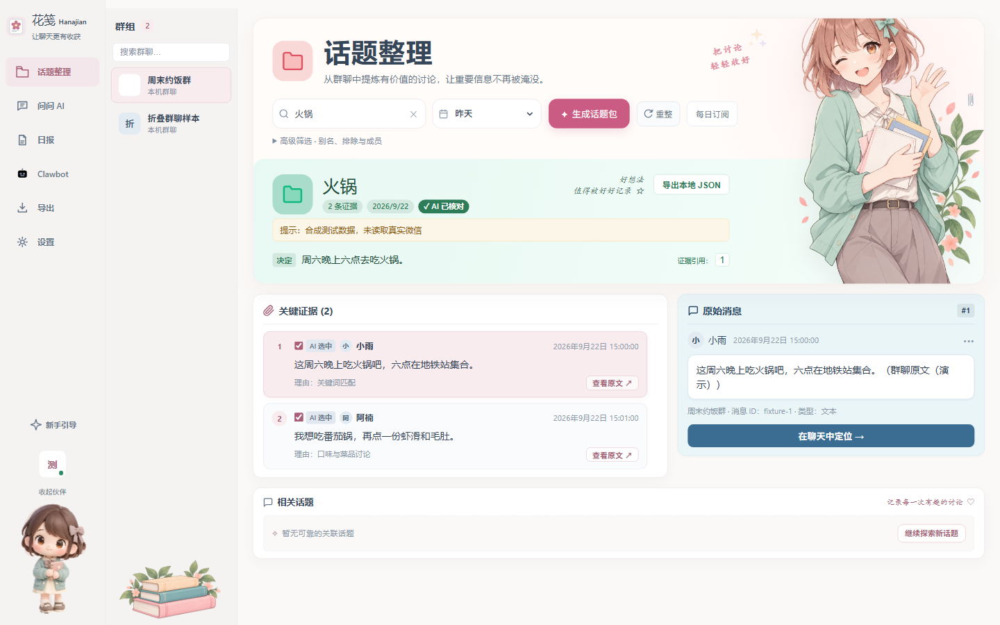

# 花笺 Hanajian

把群聊里值得记住的讨论，轻轻收好。

花笺是一个本地优先的聊天整理工具。选择群聊和话题后，可以查看整理结果、逐条核对关键证据，再回到原始消息继续阅读。纸面、薄荷绿和插画让密集的聊天内容更容易浏览。

## 从话题到原文

选择群聊与时间 → 输入想找的话题 → 查看摘要与关键证据 → 打开原始消息 → 回到聊天继续阅读。

- **话题整理**：把散落在群聊中的相关讨论收拢在一页。
- **证据追溯**：摘要、引用和原始消息保持对应，方便核对。
- **每日关注**：按北京时间定时整理，结果保存在本机，可回看来源与历史任务。
- **桌面总结**：在“问问 AI”中按群聊、时间或消息数量提问；总结指令可自定义。
- **知识笔记**：二次筛选已读取的消息，选择笔记格式和表达风格，核对草稿后写入本地 Markdown。
- **内容收藏**：解析抖音、小红书公开分享链接，预览和保存图片、视频，再写入带原链接与本地媒体链接的笔记。

[更多页面与展示素材](docs/portfolio/tracedigest/README.md) · [使用文档](docs/README.md)

## 本地开发

使用 Node.js 24 和 pnpm 7.33.7（与 `packageManager` 一致）。安装依赖后运行 `pnpm dev`；只调试界面可运行 `pnpm dev:ui`。话题摘要中的 AI 核对需要另行配置可用模型。截图使用合成群聊内容，不代表真实账号数据。

使用方法见 [知识笔记](docs/user-guide/local-notes.md) 和 [内容收藏](docs/user-guide/platform-integration.md)。AI 总结使用你配置的模型服务；内容收藏不要求连接微信数据库。应用不会登录微信机器人或向微信发送消息。

开发与构建说明见 [开发文档](docs/development/overview.md)，发布说明见 [RELEASING.md](RELEASING.md)。

代码来源、使用限制和第三方声明见 [NOTICE.md](NOTICE.md)。
